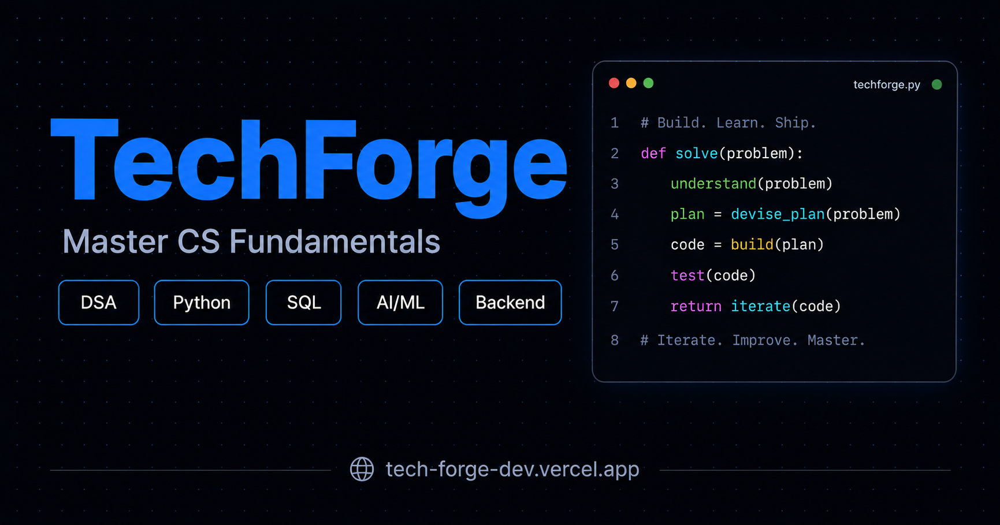

<div align="center">


# TechForge

**Free, interactive computer science learning — built for developers who want to understand, not just memorize.**

[](https://tech-forge-dev.vercel.app)
[](LICENSE)
[](https://tech-forge-dev.vercel.app)
[](#tech-stack)
[](https://vercel.com/new/clone?repository-url=https://github.com/MOHD-OMER/TechForge)

DSA visualizations · Python reference · System design guides · SQL & MongoDB · AI/ML hub · Interview prep · DevOps

</div>

---

## Overview

TechForge is a fully static, zero-dependency CS learning platform with interactive visualizers for every data structure and algorithm, 200+ curated interview problems, and seven complete learning tracks — all free, forever, with no account required.

It runs entirely in the browser. No build step, no npm, no backend.

<div align="center">

</div>

---

## Live Demo

**[tech-forge-dev.vercel.app](https://tech-forge-dev.vercel.app)**

| Track | Topics | URL |
|---|---|---|
| Data Structures & Algorithms | 29 topics · interactive visualizers | [/dsa](https://tech-forge-dev.vercel.app/dsa/index.html) |
| Python | 7 modules · basics through OOP | [/python](https://tech-forge-dev.vercel.app/python/index.html) |
| System Design | 23 deep-dive guides · Flask · FastAPI · Django | [/system-design](https://tech-forge-dev.vercel.app/system-design/index.html) |
| Databases | 14 topics · SQL, NoSQL, and specialized stores | [/databases](https://tech-forge-dev.vercel.app/databases/index.html) |
| AI / ML | 8 modules · ML to GenAI | [/aiml](https://tech-forge-dev.vercel.app/aiml/aiml-explained.html) |
| Interview Prep | 200+ problems · FAANG + startup tagged | [/interview](https://tech-forge-dev.vercel.app/interview/index.html) |
| DevOps | 23 guides · Docker · K8s · CI/CD · Cloud | [/devops](https://tech-forge-dev.vercel.app/devops/index.html) |

---

## Features

**Data Structures & Algorithms** — 29 topics across 6 categories with interactive visualizers, Big-O analysis for every topic, sorting and complexity reference tables, and a recommended learning path from beginner to interview-ready.

**Python Track** — Complete language reference covering basics, control flow, functions, OOP, collections, and libraries. Includes magic methods, decorators, comprehensions, async patterns, and 50+ annotated practice programs.

**System Design** — 23 production-grade guides covering distributed systems, caching, Kafka, load balancing, microservices, rate limiting, and more. Includes deep-dive guides for Flask, FastAPI, and Django with routing, ORM, auth, middleware, and deployment.

**Databases** — Full SQL reference with queries, joins, subqueries, window functions, and normalization. Plus 13 database deep-dives covering PostgreSQL, MySQL, Redis, MongoDB, Cassandra, DynamoDB, and more.

**AI / ML Hub** — Eight modules spanning ML, Deep Learning, NLP, Computer Vision, RL, GenAI, and a Data Science cheat sheet. Clear analogies, real math, live demos, and visual intuition — no hand-waving.

**Interview Prep** — 200+ curated problems across DSA, Python, OOP, SQL, AI/ML, DevOps, and System Design. FAANG and startup tagged, difficulty rated, progress tracked in the browser. No account, no server, no data leaves your device.

**DevOps** — 23 guides covering Git, Docker, Kubernetes, Helm, CI/CD, Jenkins, GitHub Actions, Nginx, Prometheus, Terraform, Linux, Bash, and the major cloud platforms (AWS, GCP, Azure).

---

## Tech Stack

| Layer | Choice | Reason |
|---|---|---|
| Markup | HTML5 | Semantic, accessible, universally supported |
| Styles | CSS custom properties | Single design system via `forge_base.css`, zero runtime |
| Scripts | Vanilla JavaScript | Canvas 2D API for animations; no framework overhead |
| Fonts | Google Fonts — Syne, DM Sans, JetBrains Mono | Clean reading experience across all devices |
| Deploy | Vercel (static) | Zero-config, global CDN, instant redeploys on push |

> Zero npm packages. Zero build toolchain. Zero runtime dependencies.

---

## Project Structure

```
TechForge/
├── index.html                  # Home page
├── about.html                  # About & open-source info
├── vercel.json                 # Deploy config — redirects & cache headers
│
├── assets/
│   ├── css/
│   │   ├── forge_base.css      # Global design system & CSS variables
│   │   ├── lesson.css          # Unified lesson page styles
│   │   ├── platform.css        # Progress bar, bookmarks, scroll-spy
│   │   ├── hub.css             # Section hub page styles
│   │   ├── dsa.css             # DSA visualizer styles
│   │   ├── aiml-lesson.css     # AI/ML lesson page styles
│   │   └── aiml-overview.css   # AI/ML overview styles
│   ├── js/
│   │   ├── platform.js         # Progress tracking, bookmarks, read time
│   │   ├── utils.js            # Shared utilities (search, clipboard, ARIA)
│   │   ├── topics-manifest.js  # Canonical topic registry (single source of truth)
│   │   ├── site-index.js       # Site-wide search index
│   │   └── aiml-viz.js         # AI/ML interactive visualizations
│   ├── favicon.svg
│   └── og-image.png            # Open Graph social preview (1200×630)
│
├── dsa/                        # 29 DSA topics with interactive visualizers
├── python/                     # 7 Python learning modules
├── system-design/              # 23 system design + backend framework guides
├── databases/                  # 14 database deep-dives (SQL, NoSQL, specialized)
├── aiml/                       # 8 AI/ML modules
├── interview/                  # 7 interview question banks
├── devops/                     # 23 DevOps guides
└── tools/                      # Build scripts (sitemap, content sync, audit)
```

---

## Run Locally

No install required. Any static file server works.

**Python (recommended)**
```bash
git clone https://github.com/MOHD-OMER/TechForge.git
cd TechForge
python -m http.server 8080
```
Open [http://localhost:8080](http://localhost:8080).

**Node**
```bash
npx serve .
```

**VS Code / Cursor** — Install the Live Server extension and open `index.html`.

---

## Deploy Your Own

### One-click Vercel

[](https://vercel.com/new/clone?repository-url=https://github.com/MOHD-OMER/TechForge)

### Manual

1. Fork this repository
2. Import the fork at [vercel.com/new](https://vercel.com/new)
3. Set Framework Preset to **Other**
4. Leave Build Command and Output Directory empty
5. Deploy

`vercel.json` handles all redirects and asset caching automatically.

### Netlify / GitHub Pages

Plain static HTML — drop it into any static host. No build step, no configuration beyond pointing to the root directory.

---

## Contributing

Contributions are welcome. Whether you fix a typo, improve an animation, add an interview question, or document a new algorithm — thank you. You do not need permission to open an issue or start a pull request.

### Steps

**1. Fork and clone**
```bash
git clone https://github.com/YOUR_USERNAME/TechForge.git
cd TechForge
git remote add upstream https://github.com/MOHD-OMER/TechForge.git
```

**2. Create a branch**
```bash
git checkout -b fix/heap-sort-typo
# naming: fix/ · feat/ · docs/ · a11y/
```

**3. Make changes and test**
```bash
python -m http.server 8080
# open http://localhost:8080 and verify affected pages
```

**4. Commit and push**
```bash
git add .
git commit -m "fix(dsa): correct heapify loop bound in heap sort explanation"
git push origin fix/heap-sort-typo
```

**5. Open a pull request** to `MOHD-OMER/TechForge → main` with a description of what changed and why.

### Guidelines

- Use CSS variables from `forge_base.css` — never inline colors
- Match sidebar and search markup patterns from sibling pages
- Test in Chrome and one mobile viewport before submitting
- One topic or fix per pull request
- Do not commit API keys, secrets, or personal data

### Ways to help

- Fix bugs or broken links
- Improve explanations, code examples, or quiz questions
- Add Canvas animations to DSA topics that are missing them
- Expand interview question banks (with difficulty tags)
- Improve accessibility — contrast, keyboard navigation, ARIA

---

## Reporting Issues

Open a [GitHub Issue](https://github.com/MOHD-OMER/TechForge/issues) with the page URL or file path, what you expected vs. what happened, your browser and device, and a screenshot or steps to reproduce.

---

## Roadmap

- [ ] Complete DSA canvas animation coverage (11 of 29 topics have canvas; remaining use div-based visualizers)
- [ ] AI/ML section hub page (`aiml/index.html`)
- [ ] Python track async/await deep dive
- [ ] Offline support via Service Worker
- [ ] Additional language implementations (JavaScript, Java, C++)

---

## License

MIT — see [LICENSE](LICENSE) for details. Free to use, modify, and distribute. Attribution appreciated but not required.

---

## Author

**Mohd Abdul Omer** — CS (AI/ML) Engineer

- GitHub: [@MOHD-OMER](https://github.com/MOHD-OMER)
- Live site: [tech-forge-dev.vercel.app](https://tech-forge-dev.vercel.app)

---

<div align="center">

Built for developers, by developers.<br/>
No ads. No paywalls. No tracking. Ever.

**[⭐ Star this repo if TechForge helped you learn](https://github.com/MOHD-OMER/TechForge)**

</div>