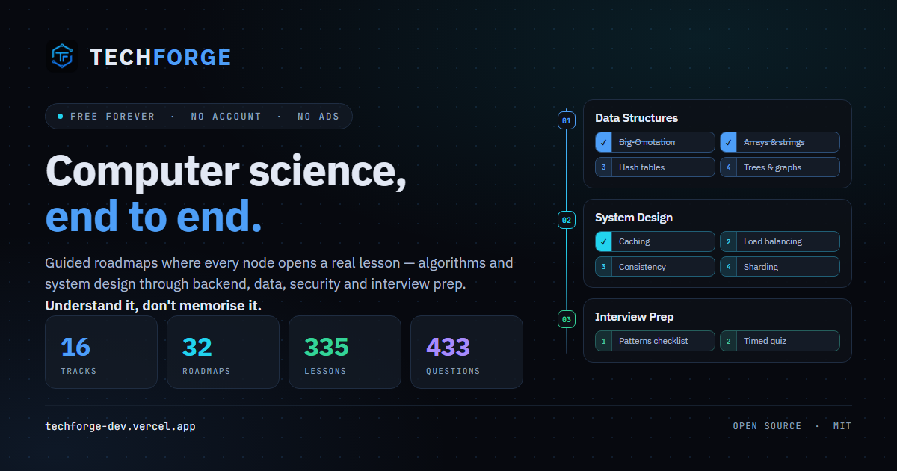

<div align="center">


# TechForge

**Free, Interactive Computer Science Learning for Developers**

[](https://techforge-dev.vercel.app)
[](LICENSE)
[](RELEASES.md)
[](https://techforge-dev.vercel.app)
[](#tech-stack)
[](https://techforge-dev.vercel.app)

**100% Static · Zero Build Step · Zero Backend · Security Hardened · Production Ready**

Roadmaps · Programming Languages · DSA · System Design · Databases · DevOps · OS & Networks · AI/ML · Interview Prep

</div>

---

## Overview

TechForge is a **fully static, zero-dependency computer science learning platform** with interactive Canvas visualizers, 32 guided roadmaps, 433 curated interview questions, and nine complete learning tracks across 246 pages — computer science from fundamentals to interview-ready.

Built entirely in **HTML5, CSS, and Vanilla JavaScript**, the platform runs completely in the browser with zero build toolchain, zero runtime dependencies, and zero backend infrastructure. (The `devDependencies` in `package.json` are validation and accessibility tooling for CI — nothing ships to the browser.) A Service Worker enables offline support: pages you've visited remain accessible without a network connection.

**Perfect for developers preparing for technical interviews, learning new topics, or reviewing fundamentals.**

<div align="center">

</div>

---

## Live Demo

**[techforge-dev.vercel.app](https://techforge-dev.vercel.app)**

| Track | Topics | URL |
|---|---|---|
| Roles | 18 career paths, grouped — build, data & AI, production, depth | [/roles](https://techforge-dev.vercel.app/roles/index.html) |
| Roadmaps | 14 topic roadmaps + 18 career paths | [/roadmaps](https://techforge-dev.vercel.app/roadmaps/index.html) |
| Data Structures & Algorithms | 29 topics · 28 Canvas visualizers · 4 language tabs | [/dsa](https://techforge-dev.vercel.app/dsa/index.html) |
| Programming | Python · JavaScript · TypeScript · Java · C++ (9 modules + programs each) | [/programming](https://techforge-dev.vercel.app/programming/index.html) |
| System Design | 26 deep-dive guides · Flask · FastAPI · Django | [/system-design](https://techforge-dev.vercel.app/system-design/index.html) |
| Databases | SQL guide (27 sections) + 14 engine deep-dives | [/databases](https://techforge-dev.vercel.app/databases/index.html) |
| DevOps | 23 guides — Git, Docker, Kubernetes, CI/CD, AWS, Terraform | [/devops](https://techforge-dev.vercel.app/devops/index.html) |
| AI / ML | 8 modules · ML to GenAI | [/aiml](https://techforge-dev.vercel.app/aiml/index.html) |
| Interview Prep | 433 questions · 13 banks · flashcards · timed quiz | [/interview](https://techforge-dev.vercel.app/interview/index.html) |
| OS & Networks | 4 complete pillars — OS, Networking, Security, Theory of Computation (32 guides) | [/systems](https://techforge-dev.vercel.app/systems/index.html) |

---

## ✨ Key Features

### Roadmaps
- **32 roadmaps on one renderer** — 14 topic roadmaps and 18 career paths
- **Spine-and-branches layout** — the trunk is the order to learn in, branches are the optional detours, and every node opens a real lesson
- **Prerequisites are real edges** — hover a step to light the whole chain leading to it
- **Generated from the site itself** — `tools/build-roadmaps.mjs` derives each roadmap from the pages and section headings it points at, so it cannot drift from the lessons
- **Statically validated** — cycles, dangling prerequisites, duplicate ids and dead links fail the build

### Data Structures & Algorithms
- **29 in-depth topics** across 6 categories
- **A visualizer on all 29 topics** — 28 interactive Canvas 2D animations, plus a step-by-step DP table fill for Dynamic Programming
- **Four language tabs** on every topic — Python, JavaScript, Java and C++, with your choice remembered
- Comprehensive coverage: arrays, linked lists, stacks, queues, trees, graphs, hashing, sorting, searching, bit manipulation, sliding window, two pointer
- Big-O analysis and a full roadmap of the track
- Step-by-step algorithm execution with visual state

### Programming Tracks
- **Five languages** — Python, JavaScript, TypeScript, Java and C++
- **8-9 modules each**, from basics through the language's advanced ground: OOP, collections, error handling, concurrency, modules and tooling
- **A practice-programs page per language** — 137 annotated Python programs, 35–40 for each of the others
- **Modules & packaging** — imports, `sys.path` resolution, circular imports, `pyproject.toml` and project layout
- Language-specific depth: Python decorators and asyncio, JS closures and the event loop, TS generics and type-level programming, Java streams and concurrency, C++ pointers and templates

### System Design
- **26 production-grade deep-dive guides**
- Topics: distributed systems, caching, Kafka, load balancing, microservices, rate limiting, consistency models, partitioning, replication
- Framework guides: Flask, FastAPI, Django (routing, ORM, auth, middleware, deployment)
- Real-world scenarios and trade-offs

### Databases
- **Full SQL reference** — 27 sections covering queries, joins, subqueries, window functions, normalization, isolation levels, execution plans, views, stored procedures, injection and sharding
- **14 database deep-dives**: PostgreSQL, MySQL, Redis, MongoDB, Cassandra, DynamoDB, CouchDB, Neo4j, InfluxDB, Elasticsearch, MariaDB, SQLite, graph databases

### AI/ML Hub
- **8 comprehensive modules** spanning ML, Deep Learning, NLP, Computer Vision, RL, GenAI
- Clear analogies, real mathematics, visual intuition
- Data Science cheat sheet
- Interactive visualizations

### Interview Preparation
- **433 curated questions** across 13 question banks
- Banks: DSA, Python, JavaScript, Java, C++, OOP, SQL, AI/ML, DevOps, System Design, OS, Networking, Security
- FAANG and startup tagged · Difficulty rated · Progress tracked in browser
- **Spaced repetition** — Leitner-box flashcards with due-card resurfacing on every bank
- **Timed MCQ quiz** — distractors generated from the bank itself, 30s timer, streaks, and a stats summary with missed-answer review

### DevOps
- **23 comprehensive guides** covering the entire DevOps landscape
- Topics: Git, GitHub, Docker, Docker Compose, Kubernetes, Helm, CI/CD, Jenkins, GitHub Actions, Nginx, reverse proxy, Prometheus, Grafana, Terraform, Ansible, Linux, Bash, Infrastructure as Code
- Major cloud platforms: AWS, GCP, Azure

### Platform & UX
- **Instant search** (`Ctrl K` / `⌘K`) — jump to any topic across all nine tracks from a keyboard-driven command palette, no page reload
- **Light / dark theme toggle** — every page, preference persists via `localStorage`, applied before first paint to avoid flash
- **Branded loading screen** — animated splash on load, so opening the app never shows a blank flash
- **Progress tracking** — mark topics and interview questions complete, saved in the browser
- **Cross-track dashboard** (`/dashboard.html`) — every track, bank and quiz in one view, with a "Focus next" panel that ranks weak areas from flashcard boxes, quiz scores and track progress
- **Reduced-motion respected** — every animation is guarded, sitewide

### Progressive Web App
- **Service Worker** (`sw.js`) with network-first HTML caching and cache-first asset strategy
- **Offline fallback** with custom `offline.html` error page
- **Installable** on mobile and desktop via `manifest.json`
- **192×512 + maskable icons** for home screen and splash screens across Android/iOS

---

## 🛠 Tech Stack

| Layer | Technology | Rationale |
|-------|-----------|-----------|
| **Markup** | HTML5 | Semantic, accessible, universally supported |
| **Styles** | CSS custom properties | Single design system via `forge_base.css`, zero runtime overhead |
| **Interactivity** | Vanilla JavaScript | Canvas 2D for all visualizations; no framework overhead |
| **PWA** | Service Worker + `offline.html` | Network-first HTML, cache-first assets, graceful offline fallback |
| **Typography** | IBM Plex Sans · JetBrains Mono | Professional reading experience, technical code clarity |
| **Icons** | Tabler Icons webfont | Consistent line-icon system, no emoji rendering differences |
| **Deployment** | Vercel (static) | Zero-config, global CDN, instant deploys, auto HTTPS, security headers |

**Zero build toolchain · Zero runtime dependencies · 100% vanilla**

npm is used for verification only — Playwright and axe-core power the CI accessibility audit, and the generators under `tools/` are plain Node scripts. Nothing in `node_modules` reaches the browser, and the site opens straight from disk.

---

## 📦 Project Structure

```
TechForge/
├── index.html                    # Home page with hero visualizer
├── about.html                    # About & open-source info
├── offline.html                  # PWA offline fallback (Vercel)
├── 404.html                      # Branded 404 error page (Vercel)
├── sw.js                         # Service Worker — offline support
├── manifest.json                 # PWA metadata & icons
├── robots.txt                    # SEO crawler directives
├── sitemap.xml                   # Generated sitemap
├── vercel.json                   # Deployment config — headers, CSP, redirects, caching
│
├── assets/
│   ├── css/
│   │   ├── forge_base.css        # Global design system, CSS variables, typography, motion
│   │   ├── lesson.css            # Unified lesson page styles
│   │   ├── platform.css          # Progress tracking, bookmarks, scroll-spy
│   │   ├── hub.css               # Section hub page styles
│   │   ├── dsa.css               # DSA-specific visualizer styles
│   │   ├── roadmap-graph.css     # Roadmap flow-chart renderer
│   │   ├── roadmap-index.css     # Roadmap directory page
│   │   ├── aiml-lesson.css       # AI/ML lesson styles
│   │   └── aiml-overview.css     # AI/ML section overview
│   ├── js/
│   │   ├── platform.js           # Progress tracking, bookmarks, reading time
│   │   ├── utils.js              # Shared utilities, theme toggle, canvas helpers
│   │   ├── search-modal.js       # Ctrl K / ⌘K instant search command palette
│   │   ├── topics-manifest.js    # Canonical topic registry (single source of truth)
│   │   ├── site-index.js         # Client-side full-site search index
│   │   ├── roadmap-graph.js      # Layout engine + SVG connectors for roadmaps
│   │   └── aiml-viz.js           # AI/ML interactive visualizations
│   ├── favicon.svg               # SVG favicon (all formats)
│   ├── icon-192.png / icon-512.png         # PWA home screen / splash icons
│   ├── icon-192-maskable.png / icon-512-maskable.png  # Android adaptive icons
│   └── og-image.png              # Open Graph social preview (1200×630)
│
├── roadmaps/                     # 14 topic roadmaps + paths/ (18 career roadmaps)
├── dsa/                          # Data Structures & Algorithms (29 topics)
├── programming/                  # Programming Languages hub
│   ├── python/ javascript/ typescript/ java/ cpp/   # 8 modules + programs each
├── system-design/                # System Design (26 guides)
├── databases/                    # Databases (SQL guide + 14 deep-dives)
├── aiml/                         # AI/ML Hub (8 modules)
├── interview/                    # Interview Prep (13 banks, 433 questions)
├── devops/                       # DevOps (23 guides)
├── systems/                      # OS & Networks (os/ networking/ security/ theory/ — 32 guides)
│
├── tools/                        # Build & utility scripts
│   ├── build-roadmaps.mjs        # Generate every roadmap from the site's own pages
│   ├── roadmap-paths.js          # Career-path milestones (build-time data)
│   ├── build-site-index.mjs      # Generate site-index.js
│   ├── generate-sitemap.mjs      # Generate sitemap.xml
│   ├── sync-all-pages.mjs        # Cross-page metadata sync
│   └── topic-content.json        # Content registry
│
├── scripts/                      # Verification suite (npm run ...)
│   ├── validate-graphs.mjs       # Roadmap graph validation — cycles, dead links, ranks
│   ├── a11y-audit.mjs            # axe-core over every page × both themes
│   ├── a11y-states.mjs           # Same, with progress state seeded
│   ├── check-roadmap-graph.mjs   # Rendered-graph smoke test
│   └── test-layout.mjs           # Layout-engine regression tests
│
├── .github/
│   └── workflows/
│       └── ci.yml                # GitHub Actions CI — HTML validation + link checking
│
├── LICENSE                       # MIT License
└── README.md                     # This file
```

---

## 🚀 Getting Started

### Run Locally

No installation required. Any static file server works.

**Python (Recommended)**
```bash
git clone https://github.com/MOHD-OMER/TechForge.git
cd TechForge
python -m http.server 8080
```
Open [http://localhost:8080](http://localhost:8080).

**Node.js**
```bash
npx serve .
```

**VS Code / Cursor**
Install the **Live Server** extension and open `index.html`.

> **Note**: The Service Worker only activates over `http://` or `https://`. Opening `index.html` as a `file://` URL will not register the Service Worker.

---

## 🔒 Security & Performance

### Security Headers (vercel.json)
- **X-Content-Type-Options**: nosniff (MIME type sniffing protection)
- **X-Frame-Options**: DENY (clickjacking prevention)
- **Referrer-Policy**: strict-origin-when-cross-origin (referrer leakage protection)
- **Permissions-Policy**: camera=(), microphone=(), geolocation=() (disable invasive APIs)
- **Content-Security-Policy**: Strict whitelist for scripts, styles, fonts, manifests

### Performance Optimizations
- **Immutable asset caching**: `/assets/*` cached for 1 year with explicit `?v=N` versioning
- **Network-first HTML**: Always fetch fresh pages, fall back to cache
- **Cache-first assets**: Use cached assets, fall back to network
- **Zero external JavaScript**: No third-party scripts or bundles
- **Minified CSS/JS**: Optimized for fast loading
- **Vercel global CDN**: Geographic distribution, instant cache invalidation

### Validation
- **100% HTML validation** (all 246 pages pass the Nu validator)
- **5,300+ links verified** (Lychee link checker in GitHub Actions)
- **WCAG 2.1 AA enforced in CI** — axe-core audits every page in both themes (246 × 2 = 492 audits, all clean); serious violations fail the build
- **Roadmap graphs validated** — cycles, dangling prerequisites, duplicate ids and dead links fail the build

Run the suite locally:

```bash
npm run validate:graphs && npm run a11y
```

---

## 🚀 Deployment

### One-Click Vercel Deploy

[](https://vercel.com/new/clone?repository-url=https://github.com/MOHD-OMER/TechForge)

### Manual Deployment

1. **Fork** this repository
2. Import the fork at [vercel.com/new](https://vercel.com/new)
3. Set **Framework Preset** to **Other**
4. Leave **Build Command** and **Output Directory** empty
5. Click **Deploy**

`vercel.json` automatically handles redirects, CSP headers, and asset caching.

### Deploy to Other Platforms

TechForge is pure static HTML—drop it anywhere:
- **Netlify**: Drag & drop the folder or connect Git
- **GitHub Pages**: Enable in repository settings
- **AWS S3 + CloudFront**: Static hosting + CDN
- **Any web host**: Just copy the files

---

## Contributing

Contributions are welcome. Whether you fix a typo, improve an animation, add an interview question, or document a new algorithm — thank you. You do not need permission to open an issue or start a pull request.

### Steps

**1. Fork and clone**
```bash
git clone https://github.com/YOUR_USERNAME/TechForge.git
cd TechForge
git remote add upstream https://github.com/MOHD-OMER/TechForge.git
```

**2. Create a branch**
```bash
git checkout -b fix/heap-sort-typo
# naming: fix/ · feat/ · docs/ · a11y/
```

**3. Make changes and test**
```bash
python -m http.server 8080
# open http://localhost:8080 and verify affected pages
```

**4. Commit and push**
```bash
git add .
git commit -m "fix(dsa): correct heapify loop bound in heap sort explanation"
git push origin fix/heap-sort-typo
```

**5. Open a pull request** to `MOHD-OMER/TechForge → main` with a description of what changed and why.

### Guidelines

- Use CSS variables from `forge_base.css` — never inline colors
- Match sidebar and search markup patterns from sibling pages
- Test in Chrome and one mobile viewport before submitting
- One topic or fix per pull request
- Do not commit API keys, secrets, or personal data

### Ways to help

- Fix bugs or broken links
- Improve explanations, code examples, or quiz questions
- Expand interview question banks (with difficulty tags)
- Improve accessibility — contrast, keyboard navigation, ARIA
- Add new topics, visualizers, or deep-dive guides

---

## 🐛 Reporting Issues

Open a [GitHub Issue](https://github.com/MOHD-OMER/TechForge/issues) with:

- **Page URL** or file path
- **Expected vs. actual behavior**
- **Browser and device** (Chrome 120 on macOS, Safari on iPhone 14, etc.)
- **Steps to reproduce**
- **Screenshot or screen recording** (if relevant)

Example:
> **Title**: Canvas visualizer crashes when switching modes  
> **URL**: /dsa/binarysearch.html  
> **Browser**: Chrome 120 on Windows 11  
> **Steps**:  
> 1. Open page  
> 2. Click "Run" button  
> 3. While animation is running, click mode dropdown  
> 4. Select "BFS"  
> **Expected**: Mode switches smoothly  
> **Actual**: Console error, visualizer freezes

---

## 📈 Roadmap

Full release notes: **[RELEASES.md](RELEASES.md)**

### v3.0.0 — shipped 2026-07-28
- [x] Guided roadmaps — 14 topic roadmaps + 7 career paths, generated from the site's own pages
- [x] Four more language tracks — JavaScript, TypeScript, Java, C++
- [x] OS & Networks section complete — 4 pillars, 32 guides
- [x] Six more interview banks (13 banks · 433 questions)
- [x] C++ implementations across DSA (4 language tabs)
- [x] Cross-track dashboard with weak-area recommendations

### v2.x — shipped
- [x] Cross-track progress dashboard (`/dashboard.html`)
- [x] Interview timed quiz mode (MCQ with generated distractors, 30s timer, streaks, stats summary)
- [x] Accessibility audit & WCAG 2.1 AA compliance (axe-core over every page × both themes, enforced in CI)
- [x] Automated test suite (HTML validation + link checking + a11y audit via Playwright, all in CI)
- [x] Code implementations (Python, JavaScript, Java, C++ toggles on all DSA topics)
- [x] Interview company tagging (FAANG / startup track filters)
- [x] Difficulty-based problem filtering on every bank
- [x] Spaced repetition / flashcard system (Leitner boxes, due-card resurfacing, localStorage-only)
- [x] "Review weak areas" recommendations

### v3.1.0 (Q3 2027)
- [ ] Build your own roadmap — pick topics, get a saved roadmap of your own
- [ ] Interactive coding challenges with an in-page editor
- [ ] Performance monitoring & analytics

### v4.0.0 (Q4 2027)
- [ ] Community discussions (GitHub-backed comments)
- [ ] User contributions system (alternative explanations, examples)
- [ ] Mobile app wrapper (React Native / Flutter)
- [ ] Social sharing & referral system


---

## 📄 License

**MIT License** — See [LICENSE](LICENSE) for full text.

You are free to use, modify, and distribute TechForge. Attribution is appreciated but not required.

---

## 👤 Author

**Mohd Abdul Omer**  
CS (AI/ML) Engineer  

- **GitHub**: [@MOHD-OMER](https://github.com/MOHD-OMER)
- **Live Site**: [techforge-dev.vercel.app](https://techforge-dev.vercel.app)
- **Email**: Contact via GitHub

---

## ❤️ Acknowledgments

- **Tabler Icons**: Free, open-source icon library
- **IBM Plex**: Beautiful, accessible typefaces
- **Vercel**: Zero-cost, zero-config static hosting
- **The open-source community**: For inspiration and support

---

<div align="center">

**Built for developers, by developers.**

Complete computer science, one platform.

[⭐ Star this repo if TechForge helped you learn](https://github.com/MOHD-OMER/TechForge)

[🚀 Start Learning](https://techforge-dev.vercel.app)

</div>