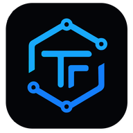

<div align="center">



# TechForge

**Computer science, end to end — free, open source, and built to be understood.**

[](https://techforge-dev.vercel.app)
[](RELEASES.md)
[](LICENSE)
[](#architecture)
[](#verification)


</div>

---

## What it is

TechForge is a computer science learning platform: **guided roadmaps where every
node opens a real lesson**, from algorithms and system design through backend,
data, security, mobile and interview preparation.

It is entirely static — HTML, CSS and vanilla JavaScript, no framework, no build
step, no backend, no accounts. Progress is stored in your browser. Every page
opens straight from disk, and the whole site is served from a CDN.

The guiding principle, which decides most of the content: **understand it, don't
memorise it.** Explanations lead with why something exists and what it costs, not
with a definition to recite.

<!-- stats:start -->
| | |
|---|---|
| Lessons | **335** pages, every one hand-written |
| Roadmaps | **32** — 14 topic, 18 career paths |
| Interview questions | **433** across 13 banks |
| Tracks | **16** |
| Runtime dependencies | **0** |
<!-- stats:end -->

**[Start here →](https://techforge-dev.vercel.app)**

---

## Tracks

<!-- tracks:start -->
| Track | Pages | Covers |
|---|---|---|
| [Roadmaps](roadmaps/index.html) | 32 | Every topic and career path, as a followable route |
| [Roles](roles/index.html) | 18 | Career paths with progress, filtering and comparison |
| [DSA](dsa/index.html) | 31 | Algorithms and data structures, with Canvas visualizers |
| [Programming](programming/index.html) | 45 | Python, JavaScript, TypeScript, Java and C++ |
| [Frontend](frontend/index.html) | 9 | The browser platform, React, tooling and accessibility |
| [Backend](backend/index.html) | 6 | Node, API design, data access and transactions |
| [System Design](system-design/index.html) | 32 | Distributed systems, plus architecture practice |
| [Databases](databases/index.html) | 14 | A full SQL guide and fourteen engine deep-dives |
| [DevOps](devops/index.html) | 33 | Containers, CI/CD, cloud, reliability and cost |
| [OS & Networks](systems/index.html) | 38 | Operating systems, networking, security, theory |
| [Data](data/index.html) | 14 | Statistics, experimentation, pipelines and modelling |
| [AI / ML](aiml/index.html) | 12 | ML through generative systems and their evaluation |
| [QA & Testing](qa/index.html) | 6 | The pyramid, automation, API and load testing |
| [Mobile](mobile/index.html) | 7 | Native and cross-platform, lifecycle to release |
| [Game Development](games/index.html) | 7 | Maths, engines, graphics, physics and netcode |
| [Blockchain](blockchain/index.html) | 5 | Consensus, smart contracts, tooling and security |
| [Interview Prep](interview/index.html) | 13 | Question banks, flashcards and a timed quiz |
<!-- tracks:end -->

Each track has a hub, a sidebar listing every lesson, and a roadmap. Lessons
carry worked examples, interview questions and a short quiz; DSA topics add a
Canvas visualizer.

---

## Architecture

Three constraints shape everything:

1. **No build step.** What is in the repository is what ships. A page can be
   opened with `file://` and it works — no bundler, no transpiler, no server
   rendering.
2. **No runtime dependencies.** Nothing in `node_modules` reaches the browser;
   it holds Playwright and axe-core for the CI audit and nothing else.
3. **Generated, not hand-maintained.** Anything duplicated across pages — the
   navbar, sidebars, the search index, the sitemap, the social card, the tables
   in this README — is written by a generator and checked by a gate, because
   every one of those drifted while it was hand-maintained.

<!-- structure:start -->
| Path | Contents |
|---|---|
| `assets/css/` | Design system and per-section styles — 10 files |
| `assets/js/` | Progress, search, roadmap renderer, topic manifest — 9 files |
| `tools/` | Generators — pages, roadmaps, navbar, search index, social card — 14 files |
| `scripts/` | Verification suite; each one is a CI gate — 13 files |
| `roadmaps/` | Topic and career roadmaps, rendered from embedded graphs — 32 pages |
| `sw.js` · `manifest.json` | Service worker and PWA metadata |
| `vercel.json` | Headers, CSP, caching and redirects |
<!-- structure:end -->

`assets/js/topics-manifest.js` is the single source of truth for what exists:
the search index, section hubs, progress tracking and the generators all read
from it.

---

## Verification

Every gate below was written after a real defect, and proven to fail before it
was wired into CI. They run on every push.

<!-- gates:start -->
| Gate | Checks |
|---|---|
| `npm run check:ci` | Every `npm run` in CI resolves to a script that exists |
| `npm run validate:graphs` | Roadmap graphs — cycles, dangling prerequisites, dead links |
| `npm run check:anchors` | Every roadmap anchor points at a heading that exists |
| `npm run check:sections` | Every section is reachable from the home page |
| `npm run check:links` | Every local link resolves from disk, not only when served |
| `npm run check:sidebars` | Every lesson is listed by its siblings and ends with prev/next |
| `npm run check:navbar` | No page has drifted from the generated navbar |
| `npm run check:entities` | No bare ampersands in HTML text |
| `npm run check:cache` | No versioned asset is stale against its last edit |
| `npm run check:readme` | This README matches the repository |
| `npm run check:og` | The social card matches the site |
| `npm run a11y` | axe-core over every page in both themes |
<!-- gates:end -->

```bash
npm ci
npm run check:ci && npm run validate:graphs && npm run check:links && npm run a11y
```

The accessibility audit renders all 335 pages in both themes with axe-core —
670 audits, and any serious violation fails the build.

---

## Running it locally

No installation is needed to read the site; any static server works.

```bash
git clone https://github.com/MOHD-OMER/TechForge.git
```

```bash
cd TechForge && python -m http.server 8080
```

Then open <http://localhost:8080>. `npx serve .` or the VS Code Live Server
extension work equally well.

> The Service Worker only registers over `http://` or `https://`. Opening
> `index.html` directly as a `file://` URL works, but without offline support.

To run the verification suite or the generators you will need Node 20+ and
`npm ci`.

---

## Deployment

The site is static, so any host that serves files will do. It is deployed to
Vercel, with `vercel.json` supplying the security headers, the content security
policy, immutable asset caching and redirects.

```bash
npx vercel --prod
```

Assets are cached for a year and busted with an explicit `?v=N` query string;
`npm run check:cache` fails the build if a file changed without its version
being bumped.

---

## Contributing

Contributions are welcome — a typo fix, a clearer explanation, a new interview
question or a whole guide. No permission needed to open an issue or a pull
request.

```bash
git checkout -b fix/heap-sort-bound
```

Before opening a pull request:

- Run the gates: `npm run check:links && npm run check:sidebars && npm run a11y`
- Use the CSS variables in `forge_base.css` — never inline a colour
- Match the markup of sibling pages; sidebars and navbars are generated, so run
  `node tools/sync-navbar.mjs` rather than editing them by hand
- One topic or fix per pull request
- Never commit keys, secrets or personal data

Adding a lesson to an existing section is `node tools/build-lesson.mjs <spec>`
followed by `node tools/link-section.mjs <section>`; the gates will tell you
what is still missing.

---

## Releases

Full notes in **[RELEASES.md](RELEASES.md)**. The current release is **v3.1.0**,
in which every roadmap node stopped being a placeholder and started opening a
written lesson.

---

## License

MIT — see [LICENSE](LICENSE). Use it, modify it, teach from it. Attribution is
appreciated and not required.

## Author

**Mohd Abdul Omer** — CS (AI/ML) engineer · [@MOHD-OMER](https://github.com/MOHD-OMER)

Typefaces by [IBM Plex](https://www.ibm.com/plex/), icons by
[Tabler](https://tabler.io/icons), hosting by [Vercel](https://vercel.com).
